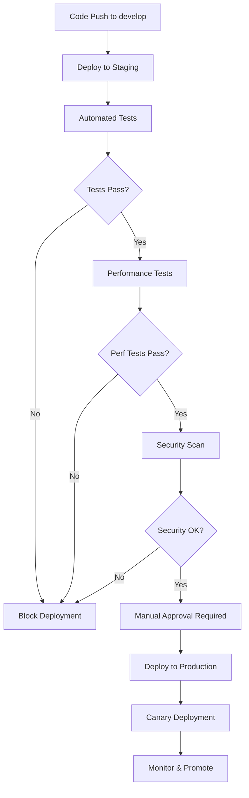

# Advanced CI/CD Guide

This guide covers the advanced CI/CD features implemented for the Zoptal platform, including blue-green deployments, canary deployments, automated rollbacks, and comprehensive monitoring.

## Table of Contents

1. [Overview](#overview)
2. [Deployment Strategies](#deployment-strategies)
3. [Automated Rollbacks](#automated-rollbacks)
4. [Deployment Orchestration](#deployment-orchestration)
5. [Monitoring and Alerting](#monitoring-and-alerting)
6. [Quality Gates](#quality-gates)
7. [Best Practices](#best-practices)

## Overview

The Zoptal platform implements a sophisticated CI/CD pipeline that supports:

- **Multiple Deployment Strategies**: Blue-green, canary, and rolling deployments
- **Automated Quality Gates**: Testing, security scanning, and performance validation
- **Intelligent Rollbacks**: Automated rollback based on metrics and health checks
- **Comprehensive Monitoring**: Real-time deployment tracking and alerting
- **Environment Promotion**: Automated promotion from staging to production

## Deployment Strategies

### 1. Blue-Green Deployment

Blue-green deployment creates a complete duplicate of the production environment (green) while keeping the current version running (blue). Traffic is switched instantly once the green environment is validated.

#### Usage

```bash
# Trigger blue-green deployment via GitHub Actions
gh workflow run deploy-blue-green.yml \
  -f service=auth-service \
  -f environment=production \
  -f rollback=false
```

#### Process Flow

1. **Prepare Phase**
   - Generate deployment ID
   - Determine current version for potential rollback
   - Validate deployment parameters

2. **Build Phase**
   - Build and push Docker image to ECR
   - Scan image for vulnerabilities
   - Block deployment if critical vulnerabilities found

3. **Deploy Green Phase**
   - Create green deployment alongside blue
   - Wait for green deployment to be ready
   - Run health checks on green environment

4. **Integration Testing**
   - Execute integration tests against green deployment
   - Validate all service endpoints
   - Check database connectivity

5. **Traffic Switch**
   - Requires manual approval for production
   - Switch load balancer to point to green
   - Monitor error rates and performance

6. **Cleanup**
   - Keep blue deployment for potential rollback
   - Rename green to primary deployment
   - Clean up temporary resources

### 2. Canary Deployment

Canary deployment gradually shifts traffic to a new version, allowing real-world validation with minimal risk.

#### Usage

```bash
# Trigger canary deployment
gh workflow run deploy-canary.yml \
  -f service=project-service \
  -f environment=production \
  -f canary-percentage=10 \
  -f auto-promote=false
```

#### Process Flow

1. **Preparation**
   - Calculate replica distribution (e.g., 10% canary, 90% stable)
   - Build and validate new version

2. **Canary Deployment**
   - Deploy canary version with reduced replica count
   - Configure Istio traffic splitting rules
   - Route specified percentage of traffic to canary

3. **Monitoring Phase**
   - Monitor for 10 minutes by default
   - Compare canary vs stable metrics:
     - Error rates
     - Response times
     - Resource usage
     - Business metrics

4. **Decision Point**
   - **Promote**: If metrics are healthy, promote canary to full deployment
   - **Rollback**: If metrics degrade, automatically rollback

### 3. Rolling Deployment

Standard Kubernetes rolling deployment with enhanced monitoring.

```yaml
# Enhanced rolling deployment configuration
apiVersion: apps/v1
kind: Deployment
metadata:
  name: auth-service
spec:
  strategy:
    type: RollingUpdate
    rollingUpdate:
      maxSurge: 25%
      maxUnavailable: 25%
  template:
    spec:
      containers:
      - name: auth-service
        image: zoptal/auth-service:latest
        readinessProbe:
          httpGet:
            path: /health
            port: 4000
          initialDelaySeconds: 30
          periodSeconds: 10
        livenessProbe:
          httpGet:
            path: /health
            port: 4000
          initialDelaySeconds: 60
          periodSeconds: 30
```

## Automated Rollbacks

### Trigger Conditions

Rollbacks are automatically triggered when:

1. **Health Check Failures**: Service health endpoint returns errors
2. **High Error Rates**: Error rate exceeds 5%
3. **Performance Degradation**: P95 latency increases by 50%
4. **Resource Exhaustion**: Memory usage exceeds 90%
5. **Business Metric Anomalies**: User error count spikes

### Rollback Process

```bash
# Manual rollback trigger
gh workflow run auto-rollback.yml \
  -f service=auth-service \
  -f environment=production \
  -f rollback-to=previous \
  -f reason="High error rate detected"
```

#### Rollback Steps

1. **Validation**
   - Verify rollback target exists
   - Check image availability in registry
   - Validate current vs target versions differ

2. **Pre-Rollback Snapshot**
   - Create configuration snapshot
   - Store in S3 for audit trail
   - Record in deployment tracking system

3. **Execution**
   - Update deployment with previous image
   - Wait for rollout completion
   - Verify pod readiness

4. **Verification**
   - Run health checks
   - Execute smoke tests
   - Monitor metrics for 10 minutes

5. **Notification**
   - Alert teams via Slack
   - Update status dashboards
   - Create incident if rollback fails

### Automated Rollback Configuration

```yaml
# Enable auto-rollback in deployment monitor
env:
  AUTO_ROLLBACK_ON_FAILURE: "true"
  ALERT_THRESHOLD_ERROR_RATE: "0.05"
  ALERT_THRESHOLD_LATENCY: "2000"
  MONITORING_DURATION: "600"
```

## Deployment Orchestration

The deployment orchestrator automatically manages the full deployment lifecycle based on code changes.

### Change Detection

```yaml
# Automatically detect changed services
- name: Detect changes
  run: |
    CHANGED_FILES=$(git diff --name-only ${{ github.event.before }} ${{ github.sha }})
    CHANGED_SERVICES=$(echo "$CHANGED_FILES" | grep '^services/' | cut -d'/' -f2 | sort -u)
```

### Quality Gates

Before any deployment, code must pass:

1. **Code Quality**
   - Linting (ESLint, TypeScript)
   - Unit test coverage (>80%)
   - Integration tests

2. **Security**
   - SAST (Static Application Security Testing)
   - Container vulnerability scanning
   - Dependency vulnerability check

3. **Performance**
   - Load testing in staging
   - Response time validation
   - Resource usage verification

### Environment Promotion



## Monitoring and Alerting

### Deployment Tracking

The deployment tracking system provides:

- **Real-time Status**: Current deployment status per service/environment
- **History**: Complete deployment and rollback history
- **Metrics**: Success rates, MTTR, deployment frequency
- **Alerts**: Failed deployments, long-running deployments

### Key Metrics

```javascript
// Deployment metrics tracked
{
  "deploymentFrequency": "deployments per day",
  "leadTime": "commit to production time",
  "mttr": "mean time to recovery",
  "changeFailureRate": "percentage of deployments causing failures",
  "rollbackRate": "percentage of deployments rolled back"
}
```

### Alerting Rules

```yaml
# Prometheus alerting rules
groups:
- name: deployment_alerts
  rules:
  - alert: DeploymentFailed
    expr: deployment_status{status="failed"} == 1
    for: 0m
    labels:
      severity: critical
    annotations:
      summary: "Deployment failed for {{ $labels.service }}"

  - alert: HighRollbackRate
    expr: rate(rollback_total[1h]) > 0.1
    for: 5m
    labels:
      severity: warning
    annotations:
      summary: "High rollback rate detected"

  - alert: DeploymentStuck
    expr: time() - deployment_start_time > 1800
    for: 0m
    labels:
      severity: warning
    annotations:
      summary: "Deployment taking longer than 30 minutes"
```

### Dashboard Metrics

The deployment dashboard shows:

- **Current Deployments**: Live status of all services
- **Recent Activity**: Latest deployments and rollbacks
- **Success Metrics**: Deployment success rate trends
- **Performance**: Deployment duration and frequency

## Quality Gates

### Pre-Deployment Gates

```yaml
# Quality gate example
quality-gates:
  runs-on: ubuntu-latest
  steps:
    - name: Unit Tests
      run: |
        COVERAGE=$(npm run test:coverage | grep 'Lines' | awk '{print $4}' | sed 's/%//')
        if [ "$COVERAGE" -lt "80" ]; then
          echo "❌ Test coverage below 80%: $COVERAGE%"
          exit 1
        fi

    - name: Security Scan
      uses: securecodewarrior/github-action-add-sarif@v1
      with:
        sarif-file: 'security-results.sarif'

    - name: Performance Budget
      run: |
        BUNDLE_SIZE=$(npm run analyze | grep 'Bundle size:' | awk '{print $3}')
        if [ "$BUNDLE_SIZE" -gt "500000" ]; then
          echo "❌ Bundle size exceeds 500KB: $BUNDLE_SIZE bytes"
          exit 1
        fi
```

### Post-Deployment Validation

```yaml
# Post-deployment checks
post-deployment-verification:
  steps:
    - name: Smoke Tests
      run: npm run test:smoke:production

    - name: Health Checks
      run: |
        for service in auth project billing; do
          curl -f https://api.zoptal.com/$service/health || exit 1
        done

    - name: Performance Validation
      run: |
        artillery run tests/performance/production-load-test.yml
```

## Best Practices

### 1. Deployment Strategy Selection

| Scenario | Recommended Strategy | Reason |
|----------|---------------------|---------|
| Critical services (auth, billing) | Blue-Green | Zero downtime, instant rollback |
| User-facing features | Canary | Gradual rollout, real user feedback |
| Internal services | Rolling | Simple, resource efficient |
| Database migrations | Blue-Green | Avoid data corruption |

### 2. Environment Management

```yaml
# Environment-specific configurations
environments:
  staging:
    auto_deploy: true
    require_approval: false
    canary_percentage: 50
    monitoring_duration: 300

  production:
    auto_deploy: false
    require_approval: true
    canary_percentage: 10
    monitoring_duration: 600
    max_concurrent_deployments: 1
```

### 3. Rollback Strategies

```bash
# Rollback decision matrix
if error_rate > 5% then
  immediate_rollback()
elif latency_p95 > 2x_baseline then
  schedule_rollback(delay=5min)
elif memory_usage > 90% then
  scale_up() or rollback()
else
  continue_monitoring()
fi
```

### 4. Testing Strategy

```yaml
# Testing pyramid for deployments
testing:
  unit_tests:
    coverage_threshold: 80%
    required: true
    
  integration_tests:
    run_on: [staging, production]
    required: true
    
  performance_tests:
    run_on: staging
    thresholds:
      p95_latency: 1000ms
      error_rate: 0%
      
  security_tests:
    sast: required
    dast: staging_only
    vulnerability_scan: required
```

### 5. Monitoring Best Practices

- **Golden Signals**: Monitor latency, traffic, errors, and saturation
- **Business Metrics**: Track user signups, revenue, conversion rates
- **Synthetic Monitoring**: Proactive health checks from multiple regions
- **Alerting**: Alert on symptoms, not causes; reduce noise

### 6. Documentation and Communication

```yaml
# Deployment communication template
deployment_notification:
  channels: ["#deployments", "#alerts"]
  include:
    - service_name
    - environment
    - version
    - deployment_type
    - status
    - rollback_plan
    - contact_person
```

## Troubleshooting

### Common Issues

1. **Deployment Stuck**
   ```bash
   # Check deployment status
   kubectl get deployments
   kubectl describe deployment <service-name>
   kubectl get events --sort-by=.metadata.creationTimestamp
   ```

2. **Health Check Failures**
   ```bash
   # Debug health check
   kubectl port-forward service/<service> 8080:80
   curl -v http://localhost:8080/health
   ```

3. **Traffic Not Switching**
   ```bash
   # Check Istio configuration
   kubectl get virtualservice
   kubectl get destinationrule
   kubectl describe virtualservice <service-name>
   ```

4. **Rollback Failures**
   ```bash
   # Manual rollback
   kubectl rollout undo deployment/<service-name>
   kubectl rollout status deployment/<service-name>
   ```

---

For additional support, refer to:
- [Deployment Troubleshooting Guide](../deployment/troubleshooting.md)
- [Monitoring and Alerting](../monitoring/README.md)
- [Security Best Practices](../deployment/security.md)