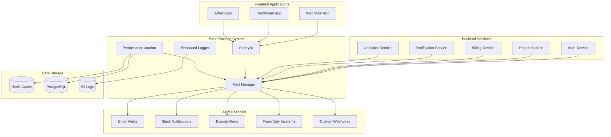

# Error Tracking and Alerting Documentation

This document covers the comprehensive error tracking and alerting system implemented for the Zoptal platform, including Sentry integration, performance monitoring, and automated alerting.

## Table of Contents

1. [Overview](#overview)
2. [Architecture](#architecture)
3. [Sentry Integration](#sentry-integration)
4. [Alert Management](#alert-management)
5. [Performance Monitoring](#performance-monitoring)
6. [Logging System](#logging-system)
7. [Service Integration](#service-integration)
8. [Frontend Error Tracking](#frontend-error-tracking)
9. [Configuration](#configuration)
10. [Best Practices](#best-practices)

## Overview

The Zoptal error tracking system provides:

- **Sentry Integration** for real-time error tracking and performance monitoring
- **Alert Management** with multi-channel notifications (email, Slack, Discord, PagerDuty)
- **Performance Monitoring** with system metrics and custom alerts
- **Enhanced Logging** with Winston-Sentry integration
- **Service-Specific Tracking** for all microservices and frontend applications
- **Automated Alerting** based on configurable rules and thresholds

## Architecture



## Sentry Integration

### Configuration

Sentry is configured per service with environment-specific settings:

```typescript
import { SentryErrorTracker, createSentryConfig } from '@zoptal/error-tracking';

// Production configuration
const sentryConfig = createSentryConfig({
  dsn: process.env.SENTRY_DSN,
  environment: 'production',
  sampleRate: 0.1, // Sample 10% of errors
  tracesSampleRate: 0.01, // Sample 1% of transactions
  enableProfiling: true,
  tags: {
    service: 'auth-service',
    version: process.env.SERVICE_VERSION,
  },
});

const sentry = SentryErrorTracker.getInstance(sentryConfig);
sentry.initialize();
```

### Error Capture

The system automatically captures various types of errors:

```typescript
// Manual error capture
sentry.captureException(error, {
  tags: { operation: 'user_login' },
  user: { id: userId, email: userEmail },
  extra: { attempt: loginAttempt },
});

// Message capture
sentry.captureMessage('User login successful', 'info', {
  tags: { operation: 'user_login' },
  user: { id: userId },
});

// Performance monitoring
const transaction = sentry.startTransaction('user_login', 'auth');
// ... perform operation
transaction.finish();
```

### Data Sanitization

Sensitive data is automatically removed from error reports:

```typescript
// Automatically sanitized fields
const sensitiveFields = [
  'password', 'token', 'secret', 'key', 'authorization',
  'cookie', 'session', 'csrf', 'credit_card', 'ssn'
];

// Custom sanitization
beforeSend: (event) => {
  return sanitizeEvent(event);
}
```

## Alert Management

### Alert Rules

Configure alerts based on various conditions:

```typescript
import { AlertManager, defaultAlertRules } from '@zoptal/error-tracking';

const alertManager = new AlertManager(alertConfig);

// High error rate alert
const errorRateAlert: AlertRule = {
  id: 'high-error-rate',
  name: 'High Error Rate',
  description: 'Error rate exceeds 5% for more than 5 minutes',
  conditions: [
    {
      type: 'error_rate',
      operator: 'gt',
      threshold: 5.0,
      timeWindowMs: 5 * 60 * 1000,
    },
  ],
  actions: [
    {
      type: 'email',
      enabled: true,
      config: { to: ['devops@zoptal.com'] },
    },
    {
      type: 'slack',
      enabled: true,
      config: { channel: '#alerts' },
    },
  ],
  enabled: true,
  priority: 'high',
  cooldownMs: 15 * 60 * 1000, // 15 minutes
};

alertManager.addRule(errorRateAlert);
```

### Alert Actions

Multiple notification channels are supported:

#### Email Alerts
```typescript
// Email configuration
email: {
  host: 'smtp.gmail.com',
  port: 587,
  secure: false,
  user: process.env.SMTP_USER,
  password: process.env.SMTP_PASSWORD,
  from: 'alerts@zoptal.com',
}
```

#### Slack Alerts
```typescript
// Slack webhook configuration
slack: {
  webhookUrl: process.env.SLACK_WEBHOOK_URL,
}

// Slack alert example
{
  type: 'slack',
  config: {
    channel: '#critical-alerts',
    username: 'Zoptal Alerts',
  },
}
```

#### Discord Alerts
```typescript
// Discord bot configuration
discord: {
  token: process.env.DISCORD_BOT_TOKEN,
}

// Discord alert example
{
  type: 'discord',
  config: {
    channelId: '1234567890123456789',
  },
}
```

#### PagerDuty Integration
```typescript
// PagerDuty alert
{
  type: 'pagerduty',
  config: {
    integrationKey: process.env.PAGERDUTY_INTEGRATION_KEY,
  },
}
```

### Processing Metrics

Feed metrics to the alert manager:

```typescript
const metricData: MetricData = {
  service: 'auth-service',
  environment: 'production',
  timestamp: new Date(),
  errorCount: 15,
  totalRequests: 1000,
  avgResponseTime: 250,
  p95ResponseTime: 500,
  customMetrics: {
    activeUsers: 1500,
    cacheHitRate: 85.5,
  },
};

alertManager.processMetrics(metricData);
```

## Performance Monitoring

### System Metrics

Automatically collect system performance metrics:

```typescript
import { PerformanceMonitor, defaultPerformanceConfig } from '@zoptal/error-tracking';

const monitor = new PerformanceMonitor(
  {
    ...defaultPerformanceConfig,
    redis: {
      host: 'localhost',
      port: 6379,
    },
    postgres: {
      host: 'localhost',
      port: 5432,
      database: 'zoptal',
      user: 'postgres',
      password: 'password',
    },
  },
  'auth-service',
  'production'
);

// Custom metrics collector
monitor.addCollector('business', async () => {
  return {
    custom: {
      activeUsers: await getActiveUserCount(),
      successfulLogins: await getLoginCount(),
    },
  };
});
```

### Performance Alerts

Automatic alerts for performance issues:

```typescript
// Performance alert thresholds
alerts: {
  cpuThreshold: 80,           // 80% CPU usage
  memoryThreshold: 85,        // 85% memory usage
  responseTimeThreshold: 2000, // 2 second response time
  errorRateThreshold: 5,      // 5% error rate
  databaseQueryThreshold: 1000, // 1 second query time
  cacheMissRateThreshold: 20, // 20% cache miss rate
}
```

### Custom Metrics

Add business-specific metrics:

```typescript
// Record custom metrics
monitor.addCustomMetric('user_signups', dailySignups);
monitor.addCustomMetric('revenue', dailyRevenue);
monitor.addCustomMetric('feature_usage', featureUsageCount);

// Performance tracking
monitor.recordRequest(responseTime, isError);
```

## Logging System

### Enhanced Logger

Winston integration with Sentry transport:

```typescript
import { EnhancedLogger, createRequestLoggingMiddleware } from '@zoptal/error-tracking';

const logger = new EnhancedLogger({
  service: 'auth-service',
  environment: 'production',
  level: 'info',
  sentry: sentryInstance,
  file: {
    filename: '/var/log/auth-service/error.log',
    level: 'error',
  },
});

// Different log levels
logger.info('User logged in successfully', { userId: '123' });
logger.warn('Password reset attempted', { email: 'user@example.com' });
logger.error('Database connection failed', error, { query: 'SELECT * FROM users' });
```

### Structured Logging

Log different types of events:

```typescript
// HTTP request logging
logger.logRequest(req, res, responseTime);

// Database query logging
logger.logQuery('SELECT * FROM users WHERE id = $1', 150, error);

// External API call logging
logger.logApiCall('POST', 'https://api.stripe.com/charges', 200, 500);

// Business event logging
logger.logBusinessEvent('user_signup', userId, { plan: 'premium' });

// Security event logging
logger.logSecurityEvent('auth_failed', userId, { reason: 'invalid_password' });

// Performance logging
logger.logPerformance('database_query', 1500, true, { table: 'users' });
```

### Middleware Integration

Express middleware for automatic logging:

```typescript
// Request logging middleware
app.use(createRequestLoggingMiddleware(logger));

// Error logging middleware
app.use(createErrorLoggingMiddleware(logger));
```

## Service Integration

### Auth Service Integration

Comprehensive error tracking for authentication:

```typescript
import {
  authRequestTrackingMiddleware,
  authErrorHandlingMiddleware,
  captureAuthError,
  logSecurityEvent,
} from './middleware/error-tracking';

// Middleware setup
app.use(authRequestTrackingMiddleware);
app.use(authUserContextMiddleware);
app.use(authErrorHandlingMiddleware);

// Custom error types
class AuthenticationError extends Error {
  constructor(message: string, public code: string = 'AUTH_FAILED') {
    super(message);
    this.name = 'AuthenticationError';
  }
}

// Error capture
try {
  await authenticateUser(credentials);
} catch (error) {
  captureAuthError(error, req, {
    operation: 'user_login',
    userId: credentials.email,
  });
  throw error;
}

// Security event logging
logSecurityEvent('login_failed', req, {
  email: credentials.email,
  reason: 'invalid_password',
});
```

### Database Operations

Wrapper functions for database operations:

```typescript
// Database query wrapper
const users = await wrapAuthDatabaseQuery(
  () => prisma.user.findMany({ where: { active: true } }),
  'find_active_users',
  'SELECT * FROM users WHERE active = true'
);

// Token operations
const token = await wrapTokenOperation(
  () => jwt.sign(payload, secret),
  'generate'
);

// Password operations
const hashedPassword = await wrapPasswordOperation(
  () => bcrypt.hash(password, 12),
  'hash'
);
```

## Frontend Error Tracking

### Next.js Integration

Frontend error tracking with Sentry:

```typescript
import { initializeWebErrorTracking, captureWebError } from '../lib/error-tracking';

// Initialize error tracking
initializeWebErrorTracking();

// Component error tracking
export function withErrorTracking<P>(Component: React.ComponentType<P>) {
  return function WrappedComponent(props: P) {
    try {
      return <Component {...props} />;
    } catch (error) {
      captureWebError(error as Error, {
        component: Component.name,
        props: sanitizeProps(props),
      });
      throw error;
    }
  };
}

// Error boundary
export const ErrorBoundary = withErrorBoundary(MyComponent, {
  fallback: ErrorFallback,
});
```

### Error Types

Frontend-specific error classes:

```typescript
// Navigation errors
class NavigationError extends Error {
  constructor(message: string, public route: string) {
    super(message);
    this.name = 'NavigationError';
  }
}

// Component errors
class ComponentError extends Error {
  constructor(message: string, public component: string) {
    super(message);
    this.name = 'ComponentError';
  }
}

// API errors
class APIError extends Error {
  constructor(message: string, public endpoint: string, public status?: number) {
    super(message);
    this.name = 'APIError';
  }
}
```

### Performance Tracking

Monitor frontend performance:

```typescript
// Performance monitoring
export function captureWebPerformance(
  name: string,
  duration: number,
  context?: {
    component?: string;
    route?: string;
    type?: 'navigation' | 'api' | 'render' | 'load';
  }
): void {
  // Track performance metrics
  Sentry.addBreadcrumb({
    message: `Performance: ${name}`,
    category: 'performance',
    data: { name, duration, ...context },
  });
  
  // Alert on slow operations
  if (duration > 3000) {
    captureWebError(new Error(`Slow operation: ${name}`), {
      tags: { performance_issue: 'slow_operation' },
      extra: { duration, threshold: 3000 },
    });
  }
}

// API call tracking
export function trackAPICall(
  endpoint: string,
  method: string,
  status: number,
  duration: number,
  error?: Error
): void {
  if (error || status >= 400) {
    captureWebError(new APIError(`API call failed: ${method} ${endpoint}`, endpoint, status));
  }
}
```

### User Session Tracking

Track user sessions and events:

```typescript
// Set user context
export function setUser(user: User): void {
  Sentry.setUser({
    id: user.id,
    email: user.email,
    username: user.name,
  });
}

// Track business events
export function trackBusinessEvent(event: string, properties?: Record<string, any>): void {
  Sentry.addBreadcrumb({
    message: `Business event: ${event}`,
    category: 'business',
    data: { event, ...properties },
  });
}

// Feature flag tracking
export function trackFeatureFlag(flag: string, value: boolean): void {
  Sentry.setTag(`feature_${flag}`, value.toString());
}
```

## Configuration

### Environment-Specific Configuration

Development vs Production settings:

```typescript
// Development configuration
const devConfig = ErrorTrackingConfig.createDevelopmentConfig('auth-service');

// Production configuration
const prodConfig = ErrorTrackingConfig.createProductionConfig('auth-service');

// Configuration differences
const config = {
  development: {
    sampleRate: 1.0,           // Capture all errors
    tracesSampleRate: 1.0,     // Trace all transactions
    debug: true,               // Enable debug logging
    logLevel: 'debug',         // Verbose logging
  },
  production: {
    sampleRate: 0.1,           // Sample 10% of errors
    tracesSampleRate: 0.01,    // Sample 1% of transactions
    debug: false,              // Disable debug logging
    logLevel: 'info',          // Standard logging
  },
};
```

### Alert Configuration

Customize alert rules per environment:

```typescript
// Production alerts
const productionAlerts: AlertRule[] = [
  {
    id: 'critical-error-rate',
    name: 'Critical Error Rate',
    conditions: [{ type: 'error_rate', operator: 'gt', threshold: 15.0 }],
    actions: [
      { type: 'email', config: { to: ['oncall@zoptal.com'] } },
      { type: 'pagerduty', config: { integrationKey: process.env.PAGERDUTY_KEY } },
    ],
    priority: 'critical',
    cooldownMs: 5 * 60 * 1000, // 5 minutes
  },
];

// Development alerts (less aggressive)
const developmentAlerts: AlertRule[] = [
  {
    id: 'high-error-rate',
    name: 'High Error Rate',
    conditions: [{ type: 'error_rate', operator: 'gt', threshold: 25.0 }],
    actions: [
      { type: 'slack', config: { channel: '#dev-alerts' } },
    ],
    priority: 'medium',
    cooldownMs: 30 * 60 * 1000, // 30 minutes
  },
];
```

## Best Practices

### 1. Error Categorization

Classify errors for better handling:

```typescript
// Use specific error classes
class ValidationError extends Error {
  constructor(message: string, public field: string) {
    super(message);
    this.name = 'ValidationError';
  }
}

class BusinessLogicError extends Error {
  constructor(message: string, public code: string) {
    super(message);
    this.name = 'BusinessLogicError';
  }
}

// Add context to errors
try {
  await processPayment(amount);
} catch (error) {
  captureError(error, {
    tags: {
      operation: 'payment_processing',
      payment_method: 'stripe',
    },
    extra: {
      amount,
      currency: 'USD',
      customer_id: customerId,
    },
  });
}
```

### 2. Sensitive Data Handling

Always sanitize sensitive information:

```typescript
// Automatic sanitization
const sanitizedData = ErrorTrackingUtils.sanitizeForLogging({
  user: {
    id: '123',
    email: 'user@example.com',
    password: 'secret123', // Will be redacted
    token: 'abc123',       // Will be redacted
  },
});

// Custom sanitization rules
const customSanitizer = (data: any) => {
  // Remove PII
  if (data.ssn) data.ssn = '[REDACTED]';
  if (data.creditCard) data.creditCard = '[REDACTED]';
  return data;
};
```

### 3. Performance Monitoring

Monitor key performance indicators:

```typescript
// Critical performance metrics
const performanceThresholds = {
  database: {
    queryTime: 1000,      // 1 second max
    connectionPool: 80,   // 80% pool usage max
  },
  api: {
    responseTime: 2000,   // 2 seconds max
    errorRate: 5,         // 5% error rate max
  },
  system: {
    cpuUsage: 80,         // 80% CPU usage max
    memoryUsage: 85,      // 85% memory usage max
  },
};

// Custom performance tracking
monitor.addCollector('business_metrics', async () => {
  return {
    custom: {
      daily_active_users: await getDailyActiveUsers(),
      conversion_rate: await getConversionRate(),
      revenue_per_user: await getRevenuePerUser(),
    },
  };
});
```

### 4. Alert Fatigue Prevention

Configure alerts to avoid noise:

```typescript
// Use appropriate cooldown periods
const alertRules = {
  critical: {
    cooldownMs: 5 * 60 * 1000,   // 5 minutes for critical
    threshold: 15,               // Higher threshold
  },
  warning: {
    cooldownMs: 30 * 60 * 1000,  // 30 minutes for warnings
    threshold: 25,               // Even higher threshold
  },
};

// Group related alerts
const errorRateRule = {
  conditions: [
    { type: 'error_rate', threshold: 5.0, timeWindowMs: 5 * 60 * 1000 },
    { type: 'error_count', threshold: 100, timeWindowMs: 5 * 60 * 1000 },
  ],
  // Both conditions must be true to trigger
};
```

### 5. Context-Rich Logging

Provide comprehensive context:

```typescript
// Rich context logging
logger.error('Payment processing failed', error, {
  user: { id: userId, plan: userPlan },
  request: { id: requestId, ip: clientIp },
  tags: {
    operation: 'payment_processing',
    payment_gateway: 'stripe',
    failure_reason: 'card_declined',
  },
  extra: {
    amount: paymentAmount,
    currency: 'USD',
    attempt_number: retryAttempt,
    card_last_four: cardInfo.last4,
  },
});

// Breadcrumb trail
Sentry.addBreadcrumb({
  message: 'User initiated payment',
  category: 'user_action',
  data: { amount: paymentAmount, plan: selectedPlan },
});
```

### 6. Testing Error Tracking

Test error tracking in development:

```typescript
// Test error capture
app.get('/test/error', (req, res) => {
  if (process.env.NODE_ENV === 'development') {
    throw new Error('Test error for Sentry');
  }
  res.status(404).json({ error: 'Not found' });
});

// Test alert system
app.get('/test/alert', async (req, res) => {
  if (process.env.NODE_ENV === 'development') {
    // Simulate high error rate
    const fakeMetrics: MetricData = {
      service: 'test-service',
      environment: 'development',
      timestamp: new Date(),
      errorCount: 150,
      totalRequests: 1000,
      avgResponseTime: 250,
      p95ResponseTime: 800,
      customMetrics: {},
    };
    
    alertManager.processMetrics(fakeMetrics);
    res.json({ message: 'Test alert triggered' });
  } else {
    res.status(404).json({ error: 'Not found' });
  }
});
```

---

For additional resources and advanced configurations, see:
- [Sentry Documentation](https://docs.sentry.io/)
- [Winston Logging Guide](https://github.com/winstonjs/winston)
- [Performance Monitoring Best Practices](../monitoring/performance.md)
- [Alert Management Configuration](../monitoring/alerting.md)