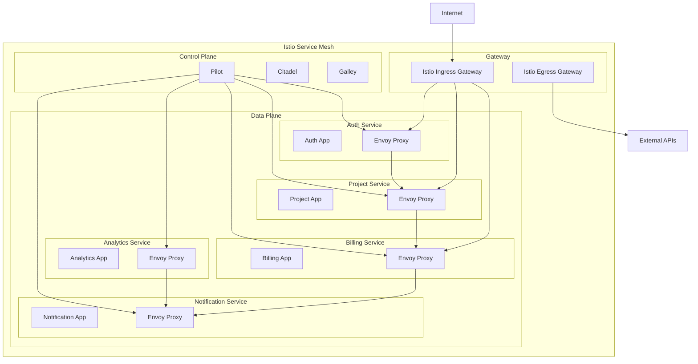

# Service Mesh Documentation

This document describes the service mesh implementation for the Zoptal platform, providing inter-service communication, load balancing, service discovery, and observability.

## Table of Contents

1. [Overview](#overview)
2. [Architecture](#architecture)
3. [gRPC Service Definitions](#grpc-service-definitions)
4. [Service Discovery](#service-discovery)
5. [Istio Integration](#istio-integration)
6. [Authentication & Authorization](#authentication--authorization)
7. [Load Balancing](#load-balancing)
8. [Circuit Breaking](#circuit-breaking)
9. [Observability](#observability)
10. [Usage Examples](#usage-examples)

## Overview

The Zoptal service mesh provides:

- **gRPC-based communication** between microservices
- **Service discovery** with health checking
- **Load balancing** with multiple strategies
- **Circuit breaking** for fault tolerance
- **Authentication** and authorization
- **Rate limiting** and traffic management
- **Observability** with metrics, logging, and tracing
- **Istio integration** for production deployments

## Architecture



## gRPC Service Definitions

### Service Interfaces

Each service exposes a gRPC interface defined in Protocol Buffers:

#### Auth Service (`auth.proto`)
- `ValidateToken()` - Validate JWT tokens
- `GetUser()` - Retrieve user information
- `GetUserPermissions()` - Get user permissions
- `CreateServiceAccount()` - Create service accounts
- `HealthCheck()` - Service health status

#### Project Service (`project.proto`)
- `GetProject()` - Get project details
- `ListUserProjects()` - List user's projects
- `CreateProject()` - Create new project
- `UpdateProject()` - Update existing project
- `CheckProjectAccess()` - Verify project permissions

#### Billing Service (`billing.proto`)
- `GetUserSubscription()` - Get subscription details
- `CheckSubscriptionLimits()` - Validate usage limits
- `RecordUsage()` - Track resource usage
- `GetSubscriptionPlans()` - List available plans

#### Notification Service (`notification.proto`)
- `SendEmail()` - Send email notifications
- `SendSMS()` - Send SMS messages
- `SendPushNotification()` - Send push notifications
- `GetNotificationHistory()` - Retrieve notification logs

#### Analytics Service (`analytics.proto`)
- `TrackEvent()` - Track user events
- `TrackPageView()` - Track page views
- `GetAnalytics()` - Retrieve analytics data
- `GetRealTimeAnalytics()` - Get real-time metrics

### Code Generation

gRPC clients and server stubs are generated from proto files:

```bash
# Generate TypeScript clients
npm run generate:grpc

# Generate for specific language
protoc --grpc_out=./generated --plugin=protoc-gen-grpc auth.proto
```

## Service Discovery

### Static Service Discovery

For development and testing:

```typescript
import { ServiceDiscovery } from '@zoptal/service-mesh';

const discovery = new ServiceDiscovery({
  healthCheckInterval: 30000,
  unhealthyThreshold: 3,
  healthyThreshold: 2,
});

// Register services manually
discovery.registerService({
  id: 'auth-service-1',
  name: 'auth-service',
  host: 'localhost',
  port: 4000,
  weight: 1,
  healthy: true,
  metadata: { version: '1.0.0' }
});
```

### Kubernetes Service Discovery

For production deployments:

```typescript
import { KubernetesServiceDiscovery } from '@zoptal/service-mesh';

const k8sDiscovery = new KubernetesServiceDiscovery(kubeConfig, {
  healthCheckInterval: 15000,
});

// Watch Kubernetes services
k8sDiscovery.watchKubernetesService('auth-service', 'zoptal');
k8sDiscovery.watchKubernetesService('project-service', 'zoptal');
```

### Health Checking

Services are continuously health-checked using gRPC health protocol:

```typescript
// Health check configuration
const healthCheckOptions = {
  healthCheckInterval: 30000,  // 30 seconds
  unhealthyThreshold: 3,       // 3 failed checks = unhealthy
  healthyThreshold: 2,         // 2 successful checks = healthy
  timeout: 5000,               // 5 second timeout
};
```

## Istio Integration

### Installation

Deploy Istio service mesh:

```bash
# Install Istio
kubectl apply -f k8s/service-mesh/istio-setup.yml

# Enable injection for namespace
kubectl label namespace zoptal istio-injection=enabled

# Deploy services with Istio sidecars
kubectl apply -f k8s/services/
```

### Traffic Management

#### Virtual Services

Route traffic based on request attributes:

```yaml
apiVersion: networking.istio.io/v1beta1
kind: VirtualService
metadata:
  name: zoptal-routing
spec:
  hosts:
  - api.zoptal.com
  http:
  - match:
    - uri:
        prefix: /api/auth
    route:
    - destination:
        host: auth-service
    retries:
      attempts: 3
      perTryTimeout: 10s
```

#### Destination Rules

Configure load balancing and circuit breaking:

```yaml
apiVersion: networking.istio.io/v1beta1
kind: DestinationRule
metadata:
  name: auth-service-dr
spec:
  host: auth-service
  trafficPolicy:
    loadBalancer:
      simple: LEAST_CONN
    circuitBreaker:
      consecutiveGatewayErrors: 5
      interval: 30s
      baseEjectionTime: 30s
```

### Security Policies

#### mTLS Configuration

```yaml
apiVersion: security.istio.io/v1beta1
kind: PeerAuthentication
metadata:
  name: default
spec:
  mtls:
    mode: STRICT
```

#### Authorization Policies

```yaml
apiVersion: security.istio.io/v1beta1
kind: AuthorizationPolicy
metadata:
  name: auth-service-policy
spec:
  selector:
    matchLabels:
      app: auth-service
  rules:
  - from:
    - source:
        principals: ["cluster.local/ns/zoptal/sa/auth-service"]
```

## Authentication & Authorization

### JWT Token Validation

```typescript
import { AuthInterceptor } from '@zoptal/service-mesh';

const authInterceptor = new AuthInterceptor({
  jwtSecret: process.env.JWT_SECRET!,
  serviceTokenSecret: process.env.SERVICE_TOKEN_SECRET,
  excludedMethods: ['/grpc.health.v1.Health/Check'],
  requiredPermissions: {
    '/zoptal.project.v1.ProjectService/CreateProject': ['project:create'],
    '/zoptal.billing.v1.BillingService/GetUserSubscription': ['billing:read'],
  },
});

// Apply to gRPC server
const server = new grpc.Server();
server.addService(AuthServiceService, authServiceImpl);
server.bind('0.0.0.0:4000', grpc.ServerCredentials.createInsecure());
```

### Service-to-Service Authentication

```typescript
// Create service account token
const serviceToken = jwt.sign({
  serviceId: 'auth-service',
  serviceName: 'Authentication Service',
  permissions: ['user:read', 'user:validate'],
}, process.env.SERVICE_TOKEN_SECRET);

// Use in gRPC metadata
const metadata = new grpc.Metadata();
metadata.set('x-service-token', serviceToken);
```

## Load Balancing

### Strategies

The service mesh supports multiple load balancing strategies:

#### Round Robin
```typescript
const endpoint = discovery.getEndpoint('auth-service', 'round-robin');
```

#### Least Connections
```typescript
const endpoint = discovery.getEndpoint('auth-service', 'least-connections');
```

#### Weighted Distribution
```typescript
// Register services with weights
discovery.registerService({
  id: 'auth-service-1',
  name: 'auth-service',
  host: 'auth-1.zoptal.svc.cluster.local',
  port: 4000,
  weight: 3, // Higher weight = more traffic
  healthy: true,
});

discovery.registerService({
  id: 'auth-service-2',
  name: 'auth-service',
  host: 'auth-2.zoptal.svc.cluster.local',
  port: 4000,
  weight: 1, // Lower weight = less traffic
  healthy: true,
});

const endpoint = discovery.getEndpoint('auth-service', 'weighted');
```

#### Random Selection
```typescript
const endpoint = discovery.getEndpoint('auth-service', 'random');
```

## Circuit Breaking

### Implementation

```typescript
import { CircuitBreaker } from '@zoptal/service-mesh';

const circuitBreaker = new CircuitBreaker(
  5,      // Failure threshold
  60000,  // Recovery timeout (1 minute)
  10000   // Monitoring period (10 seconds)
);

// Use circuit breaker
try {
  const result = await circuitBreaker.execute(async () => {
    return await grpcClient.getUser({ user_id: userId });
  });
} catch (error) {
  if (error.message === 'Circuit breaker is OPEN') {
    // Handle circuit breaker open state
    return getCachedUserData(userId);
  }
  throw error;
}
```

### Istio Circuit Breaking

Configure in DestinationRule:

```yaml
spec:
  trafficPolicy:
    circuitBreaker:
      consecutiveGatewayErrors: 5
      consecutiveServerErrors: 5
      interval: 30s
      baseEjectionTime: 30s
      maxEjectionPercent: 50
      minHealthPercent: 30
```

## Observability

### Metrics Collection

```typescript
import { MetricsInterceptor } from '@zoptal/service-mesh';

const metricsInterceptor = new MetricsInterceptor();

// Get metrics for monitoring
const metrics = metricsInterceptor.getMetrics();
console.log('Service metrics:', metrics);

// Export to Prometheus format
app.get('/metrics', (req, res) => {
  const metrics = metricsInterceptor.getMetrics();
  // Convert to Prometheus format
  res.send(convertToPrometheusFormat(metrics));
});
```

### Distributed Tracing

Configure Jaeger tracing:

```yaml
apiVersion: telemetry.istio.io/v1alpha1
kind: Telemetry
metadata:
  name: zoptal-tracing
spec:
  tracing:
  - providers:
    - name: jaeger
  - customTags:
      user_id:
        header:
          name: "x-user-id"
      request_id:
        header:
          name: "x-request-id"
```

### Logging

```typescript
import { LoggingInterceptor } from '@zoptal/service-mesh';

const loggingInterceptor = new LoggingInterceptor({
  logLevel: 'INFO',
  logRequests: true,
  logResponses: false,
  logErrors: true,
  sensitiveFields: ['password', 'token', 'authorization'],
});
```

### Rate Limiting

```typescript
import { RateLimitInterceptor } from '@zoptal/service-mesh';

const rateLimiter = new RateLimitInterceptor({
  windowMs: 60000,     // 1 minute window
  maxRequests: 100,    // 100 requests per minute
  keyGenerator: (metadata) => {
    return metadata.get('user-id')[0] || 'anonymous';
  },
});
```

## Usage Examples

### Basic gRPC Client Setup

```typescript
import { createGrpcClientManager, AuthServiceClient } from '@zoptal/service-mesh';

// Initialize client manager
const grpcManager = createGrpcClientManager({
  authService: { host: 'localhost', port: 4000 },
  projectService: { host: 'localhost', port: 4001 },
  billingService: { host: 'localhost', port: 4003 },
});

// Create service clients
const authClient = new AuthServiceClient(grpcManager);
const projectClient = new ProjectServiceClient(grpcManager);

// Use the clients
try {
  const tokenValidation = await authClient.validateToken(userToken);
  if (tokenValidation.valid) {
    const projects = await projectClient.listUserProjects(
      tokenValidation.user_id,
      1, // page
      10 // limit
    );
    console.log('User projects:', projects);
  }
} catch (error) {
  console.error('gRPC call failed:', error);
}
```

### Service Mesh Integration

```typescript
import { ServiceMesh, createServiceMesh } from '@zoptal/service-mesh';

// Create service mesh with configuration
const mesh = createServiceMesh({
  services: {
    'auth-service': {
      host: 'auth-service.zoptal.svc.cluster.local',
      port: 4000,
      maxRetries: 3,
      timeout: 30000,
    },
    'project-service': {
      host: 'project-service.zoptal.svc.cluster.local',
      port: 4001,
      maxRetries: 3,
      timeout: 30000,
    },
  },
  discovery: {
    enabled: true,
    type: 'kubernetes',
  },
  security: {
    tls: true,
    mtls: true,
    jwtSecret: process.env.JWT_SECRET,
  },
  observability: {
    metrics: true,
    tracing: true,
    logging: true,
  },
});

// Health check all services
const health = await mesh.healthCheck();
console.log('Service health:', health);
```

### Advanced Usage with Interceptors

```typescript
import * as grpc from '@grpc/grpc-js';
import {
  AuthInterceptor,
  RateLimitInterceptor,
  LoggingInterceptor,
  MetricsInterceptor,
} from '@zoptal/service-mesh';

// Create interceptors
const authInterceptor = new AuthInterceptor({
  jwtSecret: process.env.JWT_SECRET!,
  excludedMethods: ['/grpc.health.v1.Health/Check'],
});

const rateLimiter = new RateLimitInterceptor({
  windowMs: 60000,
  maxRequests: 1000,
});

const logger = new LoggingInterceptor({
  logLevel: 'INFO',
  logRequests: true,
  logErrors: true,
});

const metrics = new MetricsInterceptor();

// Apply to gRPC server
const server = new grpc.Server({
  interceptors: [
    authInterceptor.createInterceptor(),
    rateLimiter.createInterceptor(),
    logger.createInterceptor(),
    metrics.createInterceptor(),
  ],
});
```

### Error Handling and Retry Logic

```typescript
import { ServiceMeshUtils } from '@zoptal/service-mesh';

// Retry with exponential backoff
const result = await ServiceMeshUtils.retryWithBackoff(
  async () => {
    return await authClient.validateToken(token);
  },
  3, // max retries
  1000 // base delay (1 second)
);

// Timeout handling
const userWithTimeout = await ServiceMeshUtils.withTimeout(
  authClient.getUser(userId),
  10000, // 10 second timeout
  'User lookup timed out'
);

// Response validation
const validatedResponse = ServiceMeshUtils.validateResponse(
  await projectClient.getProject(projectId, userId),
  'Get project'
);
```

## Best Practices

### 1. Service Design
- Design services with clear boundaries and responsibilities
- Use protocol buffers for type-safe service contracts
- Implement proper error handling and status codes
- Include health check endpoints

### 2. Security
- Always validate tokens in service interceptors
- Use service account tokens for service-to-service calls
- Enable mTLS in production environments
- Implement proper authorization policies

### 3. Reliability
- Use circuit breakers for external dependencies
- Implement retry logic with exponential backoff
- Set appropriate timeouts for all calls
- Monitor service health continuously

### 4. Performance
- Use connection pooling for gRPC clients
- Implement proper load balancing strategies
- Cache frequently accessed data
- Monitor and optimize based on metrics

### 5. Observability
- Implement comprehensive logging
- Use distributed tracing for request flows
- Monitor key metrics (latency, error rates, throughput)
- Set up alerting for critical issues

---

For more detailed information, see:
- [Istio Documentation](https://istio.io/docs/)
- [gRPC Documentation](https://grpc.io/docs/)
- [Protocol Buffers Guide](https://developers.google.com/protocol-buffers)
- [Kubernetes Service Discovery](https://kubernetes.io/docs/concepts/services-networking/)